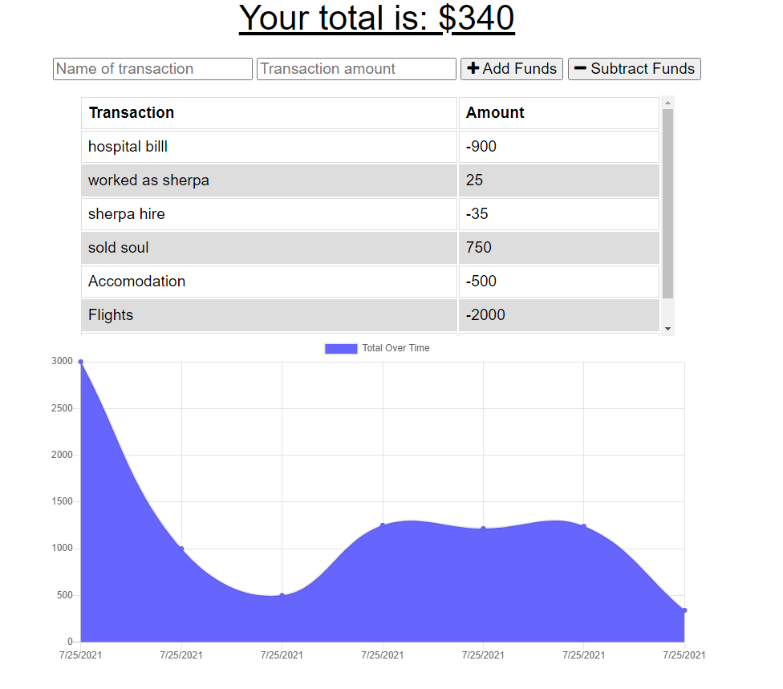

# Budget-Tracker-PWA
Budget tracking app that allows for offline access and functionality.



[Here is a link to the deployed App on Heroku](https://easy-budget-tracker.herokuapp.com/)

[Here is a link to the gitHub repo](https://github.com/brett-treweek/Easy-Budget-Tracker-PWA)  


## Description
This application was designed for a client to track their finances whilst travelling. A user can add and subtract funds, which are recorded, and a running total is displayed. Transaction history is convienientally displayed with a chart. This Progressive Web App can be installed and used offline, which is of particular use when travelling due to unknown connectivity situations. Any entries that are submitted whilst offline will be automatically uploaded when back online. This funcionality is achieved with the implementation of a webmanifest, a service worker and the IndexedDB API. MongoDB Atlas database is used as the primary online database. This app has been deployed on Heroku.

---
## Table of Contents

- [Installation](#installation)
- [Usage](#usage)
- [License](#license)
- [Contributing](#contributing)
- [Tests](#tests)
- [Technologies](#technologies)
- [Future Development](#future-development)
- [Questions](#questions)

---
## Installation  
  
Please follow these steps to install the project and any dependancies locally.

```bash
install node.js
install mongoDB
clone the repo from gitHub
npm install
create environment variables (.env)
```

---
## Usage

The best way to try the app is on heroku.  

[Follow this link to easily use the app on Heroku.](https://easy-budget-tracker.herokuapp.com/)

- Run the app locally with the following command.   

```bash
npm start
```
- Then open your browser and navigate to:
```bash
localhost:3000
```
- App can then be installed locally via browser options.

---
## License

This project is licensed under 

---
## Contributing

Contributing to this project is not currently available.

---
## Tests

Please use these commands to perform tests.

```js

There are no tests at present.

```

---

## Technologies

- HTML
- CSS
- Javascript
- Node.js
- MongoDB Atlas
- mongoose
- Express
- morgan
- dotenv
- MVC
- Heroku
- webmanifest
- service workers
- PWA
---
## Future Development
- Responsive Design
- Modern Accessability Implementation

---

## Questions

For any questions and support please contact Brett Treweek  
- Email: bretttrew@gmail.com  
- Github: [brett-treweek](https://github.com/brett-treweek)